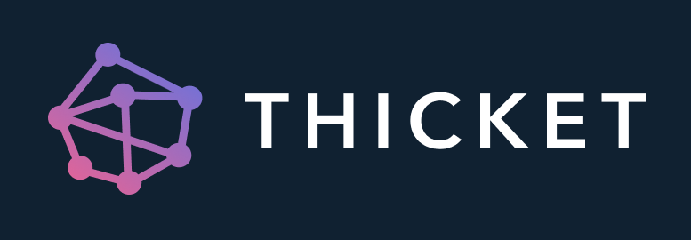

# Thicket: A decentralized Vine clone

## 

## Contents

- [Introduction](#introduction)
- [Contributing](CONTRIBUTING.md)
- [LICENSE](LICENSE)

## Introduction

Vine was a short-form video hosting service where users could share
six-second-long looping video clips. You can think of it as the "Instagram for
GIFs."

Thicket is a service that utilizes **Offline First** and
**Distributed Web** technologies to realize the same functionality without any
intermediary servers. It is Vine the app without Vine the company.

When the necessary networks and protocols are mature enough, Thicket can be used as
the base to build an entire proof-of-concept social network that stores all of its data
within its users' browsers, requiring no centralized servers for data storage.

Content created in the app is shareable to the traditional web.

## License

Thicket is available under the [MIT License](https://github.com/citrusbyte/thicket/blob/master/LICENSE).

## About Citrusbyte

This software is lovingly maintained and funded by Citrusbyte.
At Citrusbyte, we specialize in solving difficult computer science problems for startups and the enterprise.

At Citrusbyte we believe in and support open source software.
* Check out more of our open source software at Citrusbyte Labs.
* Learn more about [our work](https://citrusbyte.com/portfolio).
* [Hire us](https://citrusbyte.com/contact) to work on your project.
* [Want to join the team?](http://careers.citrusbyte.com)

*Citrusbyte and the Citrusbyte logo are trademarks or registered trademarks of Citrusbyte, LLC.*
