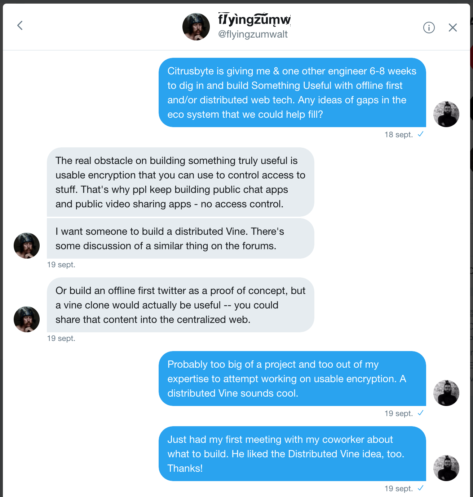

Thicket: how and why
====================

Where this Citrusbyte Labs initiative started and where it ended up.

When I got back from [speaking at Full Stack Fest](https://2017.fullstackfest.com/speakers/chadostrowski/) in September, Lucas introduced me to my next project: helping rebirth Citrusbyte Labs by doing a research project. The topic: digging deeper into the topics I’d just spoken about. Building up and showing off in-house expertise, to attract better customers and better talent for Citrusbyte. 

He thought maybe we should just focus on Offline First tech, since it’s pretty mature at this point, and already being used by companies to solve real problems.

I thought we had an opportunity to show that off, sure, but also to position ourselves ahead of an emerging new technology landscape. The Distributed Web. 

Finding a project
=================

How to research? What to build?

I reached out to a contact I made by helping organize a [Philadelphia IPFS Meetup](https://www.meetup.com/Philadelphia-IPFS-Meetup/): Matt Zumwalt ([@flyingzumwalt](https://twitter.com/flyingzumwalt)), teammate at [Protocol Labs](https://protocol.ai/), the company behind IPFS itself.

What we liked about the Distributed Vine idea

## 1. Fun

Creating GIFs and sharing them with people is fun. People would be more curious to try a product if it’s fun and beautiful. Getting more people to look at this will always benefit Citrusbyte, wether techies applying for engineering jobs or companies looking for a consultancy.

(Later, when we started building, this suspicion that a GIF-sharing app would be fun was immediately confirmed. Everyone we demoed it to enjoyed it. Our coworking spaces wanted to find out when it was live; other Citrusbyte teammates shared GIFs they'd created with it; and for ourselves, we had a hard time deleting our test GIFs every time we changed how we stored and replicated data.)

## 2. Good technology demonstration

My gold standard for what a Citrusbyte Labs project can be is Vagrant. An open-source tool that spawned a new company and changed the tech ecosystem permanently.

Lacking the expertise to build a similar tool that would likewise impact the Distributed Web landscape, we set our sites a little lower: build something fun and beautiful. Write about how we did it. Publish our work as open source. Extract open source libraries from it, as that makes sense. Be an early contributor to the conversation about how these new sorts of applications ought to be built.

## 3. Good jumping-off points

We laid out our initial plan in four steps, with the nice feature that we could stop after step 2 or 3 and still have accomplished our goal of building something fun that serves as a good technology demonstration. The initial steps: 

0. **Research** _[1 week]_

    We started off with a week or so of research. We found a large number of tools and strategies we could use for building a distributed app. We could have ended the experiment here and still had several blog posts to write about all of it.

1. **Create GIFs from device’s camera** _[1 week]_

    The very basics. All client-side functionality with no GIF sharing.

2. **The Hive Mind’s GIF Stream** _[1 week]_

    This is where we would use IPFS to share all GIFs created between all users of the app, duplicating all data between all users. As tutorials already exist on how to do this and I had previously walked through one of them, we didn’t think we would need that long to get started.

3. **User sign-in; a real social network** _[3 weeks]_

    This seemed the most risky. We had no idea how authentication would work in the decentralized web. Our initial research turned up many competing ways to do this, and we weren’t sure how simple any of them would be.

4. **Exploring Other Data Replication Strategies** _[2 weeks]_

    Replicating data with IPFS seemed like a great solution, but we would ideally love to try this with other decentralized data solutions as well, rather than playing favorites with IPFS.

Let’s tell the world ASAP
=========================

We finished Step 1 and Step 2 of the initial plan basically on schedule. It was a quick and ugly version, but we got it working. 

We wanted to post about it on discuss.ipfs.io as soon as possible. We wanted to make the project open source and work out in the open, with as much feedback and guidance from the open source community and Protocol Labs themselves as we could get.

But we have a problem
=====================

Our app allows anyone to post content, and by its very architecture resists censorship. 

Along with announcing our effort, we would want to post a demo URL. Our demo app would have Citrusbyte branding. And there next to it, public content created by the hive mind. 

We didn’t trust the hive mind to treat that kindly. Who knows what sort of unsavory content would end up disgracing our both our brand and the concept of the decentralized web.

We can’t have any public content
================================

Until we complete Step 3 of the initial plan—creating some sort of authentication—our app won’t know who anyone is. There is no way to mark certain users and their content as trusted. There is no way to kick out bad actors. All users are on equal footing, and we can’t trust content from anyone.

But Step 3, as noted, is risky. We weren’t totally sure we’d be able to complete it to our satisfaction in a timely manner. 

Wouldn’t it be better to build something useful and fun without authentication, than to risk the whole project on such a big unknown?

A solution: authentication-free “Communities”
=============================================

We abandoned the initial plan after Step 2, and went down a new side route. 

We would delay exploring decentralized identity, and focus on building a Fun new Good Technology Demonstration as quickly and as risk-free as possible. 

We would focus on the most promising route available to us that would allow us to promote a public demo containing Citrusbyte branding.

What is a Community?
====================

Since we can’t have any public content and we have no authentication, this “social network” needs to work a bit differently from others.

If you have the URL to a Community, you can see all content created by that Community. More than that, by knowing this URL, you become part of the Community. You can contribute to it, and you help back up and replicate its data. Without authentication, even a task like deleting or editing any post has to stay open to anyone in the Community.

Anyone can create a new Community and share its link with one of their trusted networks. We could have a Citrusbyte Community to which we all add GIFs. My coworking space could have its own Community. If I’ve shared a link on Slack from my desktop, then I can also click that link on my phone, and my phone can be another member of the Community, also helping to back up and replicate the data.

A concept all ours
==================

As far as we know, we created this concept of Communities. This is a concept that Citrusbyte has created and will soon offer to the larger web engineering community as a means by which to have authentication-free collaboration on the distributed web.

Whatever content (GIFs in our case) you receive from your Community, you are (automatically and instantly) re-distributing. Meaning, you are helping out your Community simply by passively consuming content—this is one of the new ideas we brought to our Communities. Not doing anything, in this case, is doing something.

Maybe a whole class of future apps won't need authentication at all.

Circling back to Authentication
===============================

With Communities, the app becomes useful even without authentication.

Authentication is an incremental improvement we can add later. Maybe as part of another Lab Experiment, or maybe in our free time once the app is open source and we are back on client work.

Everything takes longer than you think it will
==============================================

Remember when I laid out the initial plan and thought the “Hive mind’s GIF stream” part would take one week?

LOL

It’s true that we got some rudimentary version of that done pretty quickly. But to make it fully robust, with the added requirements of Communities, took several weeks. It would have gone somewhat more quickly, but the engineers on the project split up, Chad working on an explainer page while Gorka worked on the main meat of the app.

It’s actually kinda done now
============================

It just needs some styling and explanatory text.

An acceptable amount of the Communities functionality is done, but the app is pretty confusing to newcomers right now. We are working on that. We really want to finish it.

Does it matter?
===============

We realize that the project is not actually the main focus of a Citrusbyte Labs experiment. The main goals are showing off Citrusbyte expertise and getting new clients in the door. We can accomplish those goals without a complete Thicket. We can write lots of blog posts and such.

I think Thicket serves as a good capstone, a good central project. My and Gorka’s work on Thicket won’t cease when we pick up new client work. And we’ve learned all sorts of things that will take us months to share with our coworkers at Citrusbyte and the larger engineering community. 

We really want to make a splash
===============================

When we share a gorgeous, fun, usable app that demonstrates awesome new technology, we can get good press.

We can build rapport with Protocol Labs, possibly getting a call-out on the IPFS blog.

We can get to the front page of Hacker News.

If we play it right, we can even get some coverage by the actual press.

What remains to be done?
========================

Styling. 

We need to style this thing, and then we will feel good about promoting it.

Sam came up with awesome design and branding. Now we need to get busy.
